# Behaviorial Cloning Project

The goals / steps of this project are the following:
* Use the simulator to collect data of good driving behavior
* Build, a convolution neural network in Keras that predicts steering angles from images
* Train and validate the model with a training and validation set
* Test that the model successfully drives around track one without leaving the road
* Summarize the results with a written report
## Rubric Points
### Here I will consider the [rubric points](https://review.udacity.com/#!/rubrics/432/view) individually and describe how I addressed each point in my implementation.  

---
### Files Submitted & Code Quality

#### 1. Submission includes all required files and can be used to run the simulator in autonomous mode

My project includes the following files:
* model.py containing the script to create and train the model
* drive.py for driving the car in autonomous mode
* model.h5 containing a trained convolution neural network 
* writeup_report.md or writeup_report.pdf summarizing the results

#### 2. Submission includes functional code
Using the Udacity provided simulator and my drive.py file, the car can be driven autonomously around the track by executing 
```sh
python drive.py model.h5
```

#### 3. Submission code is usable and readable

The model.py file contains the code for training and saving the convolution neural network. The file shows the pipeline I used for training and validating the model, and it contains comments to explain how the code works.

### Model Architecture and Training Strategy

#### 1. An appropriate model architecture has been employed

Throughout the project I tested 3 models: [LeNet](http://yann.lecun.com/exdb/publis/pdf/lecun-01a.pdf), model proposed by [Comma.ai](https://github.com/commaai/research/blob/master/train_steering_model.py) and model reported in [Nvidia paper](https://arxiv.org/pdf/1604.07316v1.pdf) for end-to-end learning for self-driving cars. The last, Nvidia model turned out to be the best for the data used in the project. It's a well known Convolutional Neural Network recently, it has about 27 million connections and 250 thousand parameters. 

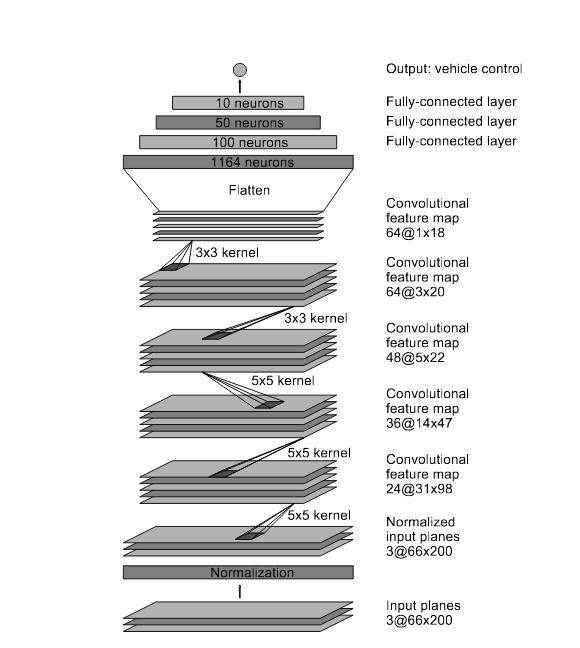</br></br>

#### 2. Attempts to reduce overfitting in the model

The model contains dropout layers in order to reduce overfitting (model.py lines 116-124). After unsuccessful trials of the model and overfitting suspitions I tried to reduce the model complexity but it didn't help much. I would say that it was important to have not so much collected data (about 10 laps were enough).

The model was trained and validated on different data sets to ensure that the model was not overfitting (code line 206). The model was tested by running it through the simulator and ensuring that the vehicle could stay on the track.

#### 3. Model parameter tuning

The model used an adam optimizer, so the learning rate was not tuned manually (model.py line 131). I tuned a bit the batch size and stayed at batch size equal 128. Also I was choosing the number of epochs mainly between 2 and 10. Finally, it was sufficient to run the training only on 3 epochs. 

#### 4. Appropriate training data

Training data was chosen to keep the vehicle driving on the road. I used a combination of center lane driving and recovering from the left and right sides of the road. For the center lane driving I used the dataset prepared by Udacity - about 8 laps. Then, by driving the simulator manually, I collected samples for recovery situations. One lap where a car has to recover from different places at the right side of the road, another lap for the left lane recovery. Additionally I saved my manual proper driving for turn no. 2 and no. 3 as the model had some problems with them before. 

For details about how I created the training data, see the next section. 

### Model Architecture and Training Strategy

#### 1. Solution Design Approach

The overall strategy for deriving a model architecture was to try different known models and add/remove layers based on a feeling that given model can generalize well. My first step was to use a convolution neural network model similar to the LeNet model. I thought this model might be appropriate because it worked well in previous project. However, after some investigation I observed that the Nvidia model work better in general. 

In order to gauge how well the model was working, I split my image and steering angle data into a training and validation set. I found that my first model had a low mean squared error on the training set but a high mean squared error on the validation set. This implied that the model was overfitting. To combat the overfitting, I modified the model so that after each convolutional layer there is a dropout layer. Also, to increase nonlinearity, "ELU" activation layers were placed after each layer of the model.

The final step was to run the simulator to see how well the car was driving around track one. There were a few spots where the vehicle fell off the track, especially during the turn after crossing the bridge. To improve the driving behavior in these cases, I tried to simplify the model architecture for better generalization but it didn't help. So, I just added new samples covering the problematic spots.

At the end of the process, the vehicle is able to drive autonomously around the track without leaving the road.

#### 2. Final Model Architecture

The final model architecture (model.py lines 106-134) consisted of a convolution neural network with the following layers and layer sizes 

* Image normalization - using Keras lambda layer
* Convolution: 5x5, filter: 24, strides: 2x2, activation: ELU
* Dropout (0.4)
* Convolution: 5x5, filter: 36, strides: 2x2, activation: ELU
* Dropout (0.4)
* Convolution: 5x5, filter: 48, strides: 2x2, activation: ELU
* Dropout (0.4)
* Convolution: 3x3, filter: 64, strides: 1x1, activation: ELU
* Dropout (0.4)
* Convolution: 3x3, filter: 64, strides: 1x1, activation: ELU
* Dropout (0.4)
* Flattening
* Fully connected: neurons: 100, activation: ELU
* Fully connected: neurons: 50, activation: ELU
* Fully connected: neurons: 10, activation: ELU
* Fully connected: neurons: 1 (output)

Total number of parameters (all are trainable) equals 297019.

#### 3. Creation of the Training Set & Training Process

To capture good driving behavior, I used the data provided by Udacity - about 8 laps of center lane driving. Here is an example image of center lane driving:

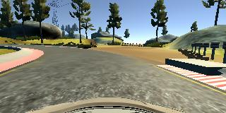</br></br>

I then recorded the vehicle recovering from the left side and right sides of the road back to center so that the vehicle would learn to quickly apply bigger steering angle when it's suddenly off the track. These images show what a recovery samples looks like starting from the situation when a car has one tire on the road edge and ending with a car properly set in the middle of the road. 

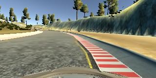  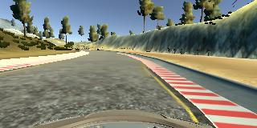  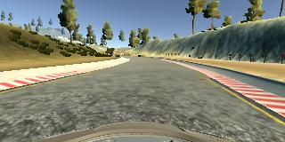</br></br>

After samples were collected, for each sample there are 3 camera views available. I randomly selected which camera to choose in each case. If left or right camera was chosen, the appropriate shift (0.25) was applied to the steering angle.

To augment the data sat, I also flipped images and angles in 50% of samples (as suggested in Vivek Yadav [post](https://chatbotslife.com/using-augmentation-to-mimic-human-driving-496b569760a9)). It eliminated model bias towards negative values of steering angle (we drive the track clockwise, so most of the center lane driving steering angles are negative). Each time the image was flipped, the corresponding steering angle was reversed. For example, here is an image that has then been flipped:

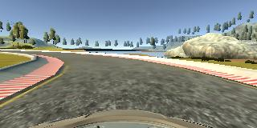  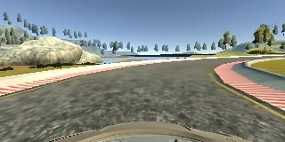</br></br>

After the collection process, I had 9127 number of data points. I then preprocessed this data by removing 85% of samples whose steering angle was really, really close to 0. The idea (proposed in Mohan Karthik [post](https://medium.com/@mohankarthik/cloning-a-car-to-mimic-human-driving-5c2f7e8d8aff)) behind this operation is to reduce angles near to zero as there are a huge number of such samples which could bias the model towards predicting 0 angle. Below there are histograms of training samples before this operation and after:

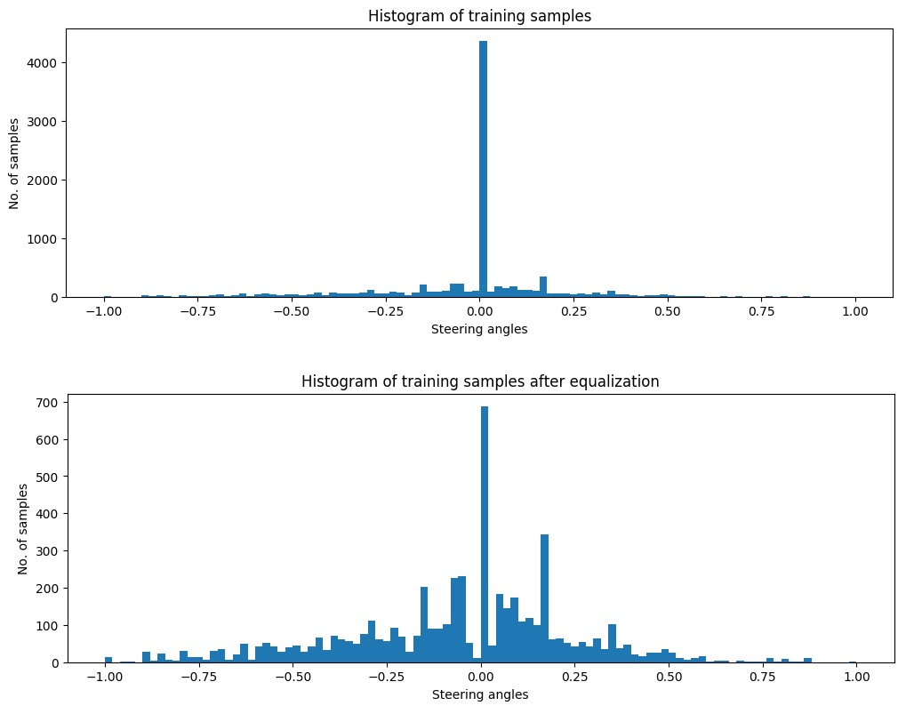</br></br>

The final histogram depicts samples and their angles after the flipping operation:

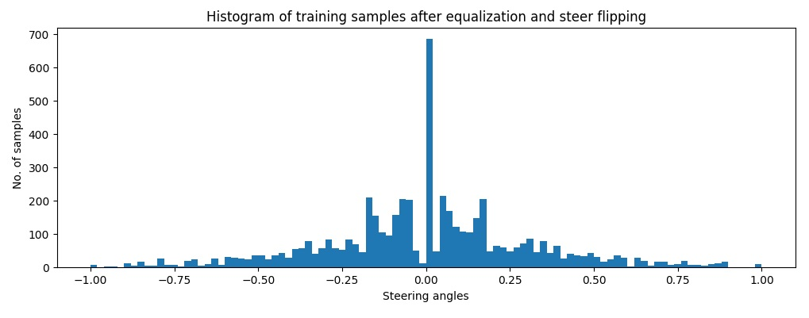</br></br>

I finally rescaled images from 160x320 pixels to 160x100. Then, using Keras Cropping2D layer I cropped 40 rows from the top and 20 rows from the bottom of each image. This removed unnecessary information about sky, trees and the car hood at the bottom. The final image size was 100x100 which was intentional and is regarded easier for CNN to operate when the input image is a square.

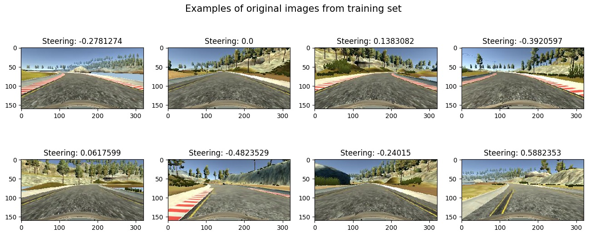</br></br>
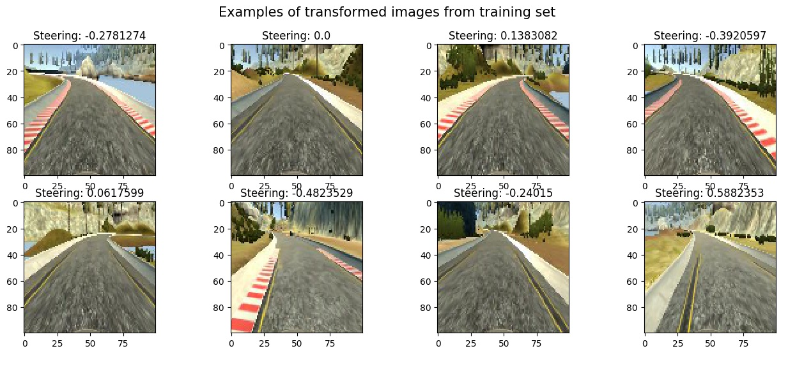</br></br>

I used this training data for training the model. The validation set helped determine if the model was over or under fitting. The ideal number of epochs was 2 as it was not so time consuming and the model already worked. I used an adam optimizer so that manually training the learning rate wasn't necessary.

